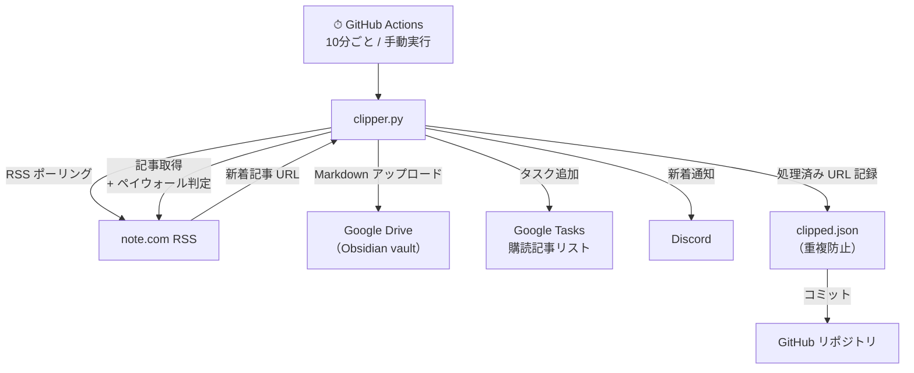

# note-clipper

note.com の購読記事を自動取得し、Google Drive（Obsidian vault）に保存する GitHub Actions ワークフロー。

## アーキテクチャ



## 概要

- note.com の RSS を10分ごとにポーリング
- 未保存の新着記事を Markdown に変換して Google Drive にアップロード
- ペイウォール（未購入）記事はスキップ
- 新規保存時に Discord へ通知 + Google Tasks にタスク追加

## GitHub Secrets

Settings → Secrets and variables → Actions に以下を登録する。

### `NOTE_COOKIES`

note.com のログイン Cookie（JSON形式）。Firefox の `cookies.sqlite` から `setup/extract_cookies.py` で抽出する。

```json
{
  "apay-session-set": "...",
  "note_gw": "...",
  "_note_session_v5": "..."
}
```

Cookie の有効期限が切れたら再取得が必要。

---

### `GOOGLE_TOKEN`

Google Drive API / Google Tasks API の OAuth2 トークン（JSON形式）。`setup/init_auth.py` を実行すると `setup/google_token.json` が生成されるので、その中身をそのまま貼る。

```json
{
  "token": "...",
  "refresh_token": "...",
  "token_uri": "https://oauth2.googleapis.com/token",
  "client_id": "...",
  "client_secret": "...",
  "scopes": [
    "https://www.googleapis.com/auth/drive",
    "https://www.googleapis.com/auth/tasks"
  ],
  "expiry": "..."
}
```

`refresh_token` があれば自動更新されるため、基本的に再登録不要。

---

### `FOLDER_IDS`

Google Drive のフォルダパス → フォルダID のマッピング（JSON形式）。`setup/init_drive_paths.py` を実行すると `config/folder_ids.json` が生成されるので、その中身をそのまま貼る。

```json
{
  "obsidian_sync/Investment/raw/ABC Trader/記事": "<folder_id>",
  "obsidian_sync/Investment/raw/そーなんだ化学": "<folder_id>",
  "obsidian_sync/Investment/raw/パウロ": "<folder_id>"
}
```

著者を追加・変更した場合は `setup/init_drive_paths.py` を再実行してシークレットを更新する。

---

### `TASKS_LIST_ID`

Google Tasks のタスクリスト ID。以下のスクリプトでリスト一覧を確認できる。

```python
from google.oauth2.credentials import Credentials
from googleapiclient.discovery import build
import json

creds = Credentials.from_authorized_user_info(json.loads(open("setup/google_token.json").read()))
service = build("tasks", "v1", credentials=creds)
for tl in service.tasklists().list().execute().get("items", []):
    print(tl["title"], tl["id"])
```

---

### `DISCORD_WEBHOOK`

Discord の Incoming Webhook URL。通知を送りたいチャンネルの設定から取得する。

```
https://discord.com/api/webhooks/...
```

## セットアップ手順

1. `setup/extract_cookies.py` — Firefox から note.com Cookie を抽出 → `NOTE_COOKIES` に登録
2. `setup/init_auth.py` — Google OAuth 認証（Drive + Tasks スコープ）→ `GOOGLE_TOKEN` に登録
3. `setup/init_drive_paths.py` — Drive フォルダ ID を取得 → `FOLDER_IDS` に登録
4. Google Tasks で「購読記事」リストを作成し ID を取得 → `TASKS_LIST_ID` に登録
5. `setup/init_clipped.py` — 既存 vault をスキャンして重複防止リストを初期化
6. GitHub Actions で Run workflow を実行して動作確認

## ファイル構成

```
note-clipper/
├── src/
│   ├── clipper.py       # メインエントリーポイント
│   ├── config.py        # 著者設定
│   ├── note_fetcher.py  # RSS取得・記事スクレイピング
│   ├── gdrive.py        # Google Drive アップロード
│   └── converter.py     # Markdown変換・ファイル名生成
├── setup/
│   ├── extract_cookies.py   # Firefox Cookie抽出
│   ├── init_auth.py         # Google OAuth認証
│   ├── init_drive_paths.py  # Drive フォルダID取得
│   └── init_clipped.py      # 既存記事の重複防止登録
├── clipped.json         # 処理済みURL一覧（自動更新）
├── requirements.txt
└── .github/workflows/clip.yml
```
